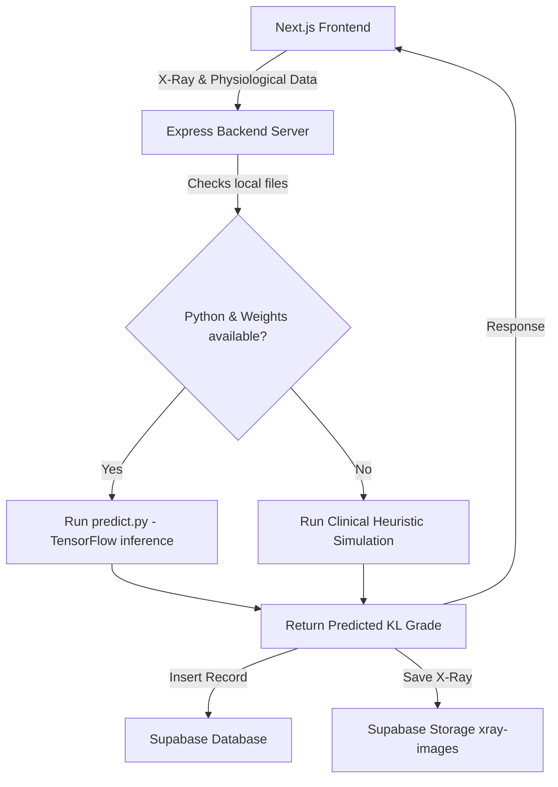

# Knee Osteoarthritis Detection & Prediction System 🩺

An advanced medical diagnostic assistant that evaluates Knee Osteoarthritis (KOA) severity. By employing a deep learning **VGG16 Transfer Learning model** combined with physiological indicators and WOMAC clinical scores, the system calculates the **Kellgren-Lawrence (KL) Grade (0-4)** and models patient health tracking.

---

## 🌟 Key Features

*   **Multi-Step Diagnostics Wizard (`/details`)**:
    *   **Interactive Crop Tool**: Isolation of joint space using a draggable square cropper (`react-image-crop`).
    *   **Physiological Parameters**: Automatic on-the-fly BMI calculation from height and weight metrics.
    *   **WOMAC Assessment Index**: Patient knee pain, stiffness, and physical limitations mapping.
*   **Analytics Dashboard (`/results`)**:
    *   **Progression Charting**: Comparison line chart tracking `currentKL` and `previousKL` over 5 years.
    *   **Radial Gauge**: High-contrast circular SVG gauge emphasizing predicted KL Grade.
    *   **Historical Records**: Teal-header detailed logs of previous diagnostics.
*   **Patient Portal (`/dashboard`)**:
    *   One-stop console displaying the patient's latest clinical profile (BMI, heart bypass history, muscle swelling).
    *   Chronological timeline of all scans with severity badges.
    *   Unified secure session logout action.
*   **Offline Resilience**: Dynamic developer fallback that executes heuristic simulation parameters if local TensorFlow packages or Supabase keys are missing.

---

## 🏗️ System Architecture



---

## 🛠️ Tech Stack

*   **Frontend**: Next.js 16 (App Router), Tailwind CSS, Recharts, Lucide Icons, React Image Crop, TypeScript.
*   **Backend**: Node.js, Express, Multer, WS (WebSockets support for Node <22).
*   **ML Engine**: Python 3, TensorFlow-CPU, NumPy, Pillow, VGG16 (ImageNet transfer weights).
*   **Database & Security**: Supabase (PostgreSQL, Storage Buckets, Auth, RLS Policies).

---

## ⚙️ Local Development Setup

### 1. Model Weights Configuration
Download your pre-trained model weights `bottleneck_fc_model.h5` and save it to the backend model directory:
```bash
backend/model/bottleneck_fc_model.h5
```

### 2. Database Migration (Supabase)
Create a Supabase project and execute the SQL migration script:
1. Open the **SQL Editor** in the Supabase Dashboard.
2. Run the queries inside `supabase_schema.sql` located at the root of this workspace.
3. In **Storage**, create a new public bucket named `xray-images`.

### 3. Environment Keys Configuration
Create a `.env` file in the `backend` folder:
```env
PORT=5000
SUPABASE_URL=your_supabase_project_url
SUPABASE_KEY=your_supabase_service_role_key
```

Create a `.env.local` file in the `frontend` folder:
```env
NEXT_PUBLIC_SUPABASE_URL=your_supabase_project_url
NEXT_PUBLIC_SUPABASE_ANON_KEY=your_supabase_anon_key
NEXT_PUBLIC_API_URL=http://localhost:5000
```

### 4. Running the Applications
Start the Node.js server and Next.js frontend in separate terminal panes:

**Backend Server**:
```bash
cd backend
npm install
npm run dev
```

**Frontend client**:
```bash
cd frontend
npm install
npm run dev
```
Open `http://localhost:3000` in your web browser.

---

## ☁️ Production Deployment

### 1. Backend Web Service (Render / Railway)
The backend includes a `Dockerfile` that packages Node.js, Python, and virtual environments automatically.
1. Connect your GitHub repository to **Render.com**.
2. Create a new **Web Service** selecting **Docker** as the environment.
3. Configure the environment variables (`PORT=5000`, `SUPABASE_URL`, `SUPABASE_KEY`).
4. Note the output deployment domain (e.g., `https://koa-backend.onrender.com`).

### 2. Frontend client (Vercel)
1. Link your GitHub repository in **Vercel**.
2. Set the **Root Directory** of the project build to `frontend`.
3. Add the production environment variables:
    *   `NEXT_PUBLIC_SUPABASE_URL`
    *   `NEXT_PUBLIC_SUPABASE_ANON_KEY`
    *   `NEXT_PUBLIC_API_URL` (your Render service domain from step 1)
4. Trigger the deployment.